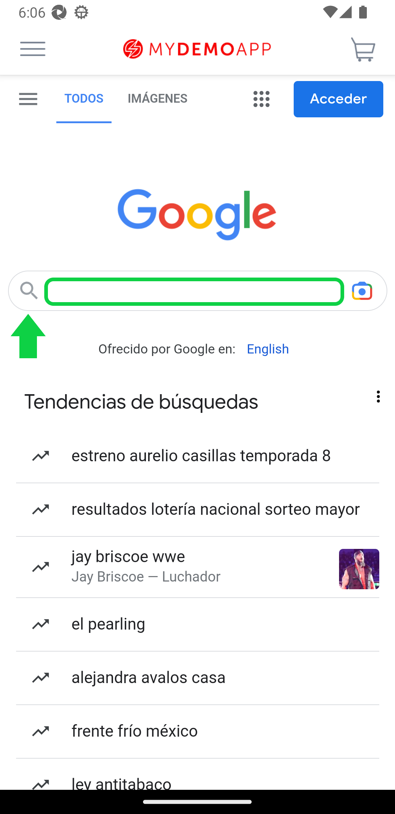
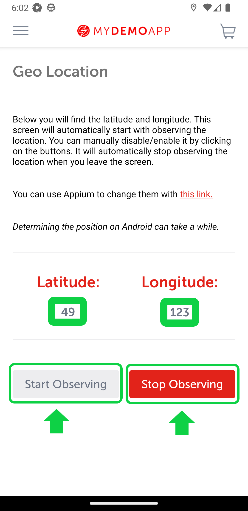

# Test Automation Framework for Android App
### Using:
- Appium
- Selenium
- Java 8
- Cucumber to BDD
- TestNG

## Test Cases
1. View Catalog
````
Feature: Add catalog element to card
    As a user
    I want to be able to add elements of a catalog to a card
    So that I can keep track of the items I am interested in
@SmokeTest
    Scenario: Add an element to a card
        When The user selects an element
        And Clicks on the Add to card button
        Then The element should be added to the user's card
````

|                     Catalog View                      |                     Product View                      | Cart View                                             |
|:-----------------------------------------------------:|:-----------------------------------------------------:|:------------------------------------------------------|
|  |  |  |

2. View WebView
````
Feature: Navigate to a website in a WebView
    As a user
    I want to be able to navigate to a website in a WebView
    So that I can use the website's functionality within my app
@SmokeTestWebView
    Scenario: Navigate to a website in a WebView
        Given The user is on the home screen
        When The user clicks on the burger button
        And Clicks on the WebView option
        And Inserts the URL "https://www.google.com.mx" into the input field
        And Clicks on the Go to site button
        Then The website should be displayed in the WebView
        And The user inserts "hello world" in the google page
        And Clicks on the search button
        Then The search results should be displayed
````
|                        WebView                        | Google Search                                         |
|:-----------------------------------------------------:|:------------------------------------------------------|
|  |  |

3. View Geo Location
````
Feature: Geolocation functionality
    As a user
    I want to be able to access and use the geolocation feature of the device
    So that I can see my current location
@SmokeGeoLocation
    Scenario: Access and use geolocation feature
        Given The user opens the geolocation page
        Then The latitude and longitude should be different from "0"
        When The user clicks on the Stop Observing button
        And The user clicks on the Start Observing button
        Then The geolocation should be updated and displayed on the page
````
|                     Geo Location View                     |
|:---------------------------------------------------------:|
|  |